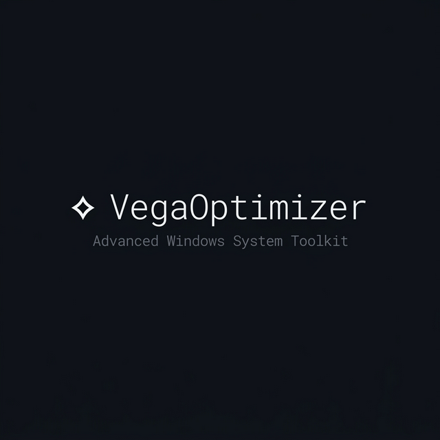

<p align="center">
  
</p>

<p align="center">
  <strong>Advanced Windows System Optimizer & Toolkit</strong><br>
  <sub>Built with Tauri v2 · React · Rust — Native performance, zero bloat</sub>
</p>

<p align="center">
  <a href="#features"></a>
  <a href="#tech-stack"></a>
  <a href="#tech-stack"></a>
  <a href="#tech-stack"></a>
  <a href="LICENSE"></a>
</p>

---

## Overview

VegaOptimizer is a **native Windows system toolkit** that provides real-time monitoring, deep optimization, and system maintenance — all in a single lightweight application. Built with a Rust backend for direct Win32 API access and a React frontend for a modern, responsive UI.

Unlike Electron-based alternatives, VegaOptimizer runs with **minimal memory footprint** (~15 MB) and has **direct kernel-level access** for memory management, process trimming, and service control.

---

## Features

### 📊 Monitor
| Module | Description |
|--------|-------------|
| **Dashboard** | Real-time CPU, RAM, swap, per-core usage, temperatures, and system health score (0-100) |
| **Network Monitor** | Per-process connection tracking, TCP/UDP breakdown, top talkers, and ping testing |

### ⚡ Optimize
| Module | Description |
|--------|-------------|
| **System Optimizer** | 30+ optimization items across memory, processes, services, disk, and network — with 5 preset profiles (Gaming, Productivity, Battery Saver, Deep Clean, Safe Mode) |
| **Process Manager** | AI-powered suggestions for bloated/idle/duplicate processes, bulk trim with estimated savings, and per-process kill |
| **Startup Manager** | Enable/disable startup entries with impact ratings and registry-level toggling |
| **Services Manager** | Full Windows service control — start, stop, filter by category (essential, optional, telemetry, gaming) with safety recommendations |

### 🧹 Cleanup
| Module | Description |
|--------|-------------|
| **Disk Analyzer** | Browser cache detection + cleanup, large file scanner (>100 MB), bulk delete with file selection |
| **Privacy Cleanup** | Remove tracking data, browsing traces, recent file history, and telemetry artifacts |
| **Windows Debloater** | Detect and remove preinstalled bloatware (AppX packages) with safe-to-remove classification |
| **Registry Cleaner** | Scan for orphaned keys, broken shortcuts, invalid paths, obsolete CLSIDs — with individual and bulk fix |
| **Duplicate Finder** | Content-hash-based duplicate file detection with configurable minimum size and bulk delete |

### 🔧 System
| Module | Description |
|--------|-------------|
| **System Benchmark** | CPU single/multi-core scoring, RAM read/write/latency, disk sequential/random IOPS |
| **Disk Health** | S.M.A.R.T. attribute monitoring, health percentage, temperature tracking per drive |
| **Driver Manager** | List all installed drivers with signature verification status |
| **Hardware Info** | Full hardware inventory — CPU, RAM, GPU, storage, network adapters |
| **Battery Health** | Design vs. actual capacity, wear percentage, cycle count, charge rate, and estimated runtime |

---

## Tech Stack

```
Frontend:   React 19 + TypeScript + Vite 7
Backend:    Rust + Tauri v2
Styling:    Vanilla CSS (dark theme, no framework)
Win32 API:  winapi (kernel-level memory/process/registry access)
System:     sysinfo, tokio (async runtime)
```

---

## Prerequisites

- **Windows 10/11** (x64)
- [Node.js](https://nodejs.org/) v18+
- [Rust](https://rustup.rs/) (latest stable)
- [Tauri CLI](https://v2.tauri.app/start/prerequisites/) prerequisites

---

## Getting Started

### Clone & Install

```bash
git clone https://github.com/Pastarafian/VegaOptimizer.git
cd VegaOptimizer
npm install
```

### Development (with hot reload)

```bash
npx tauri dev
```

Or use the included launcher (requests admin for full functionality):

```bash
.\launch.bat
```

### Build for Production

```bash
npx tauri build
```

This produces an `.msi` installer and portable `.exe` in `src-tauri/target/release/bundle/`.

---

## Project Structure

```
VegaOptimizer/
├── src/                    # React frontend
│   ├── App.tsx             # All 16 page components
│   ├── index.css           # Complete design system
│   └── main.tsx            # Entry point
├── src-tauri/              # Rust backend
│   ├── src/
│   │   ├── lib.rs          # Tauri command registration + core commands
│   │   ├── optimizer.rs    # 30+ optimization items + profiles
│   │   ├── scanner.rs      # File scanner, browser cache detection
│   │   ├── monitor.rs      # Live metrics, health scoring
│   │   ├── startup.rs      # Startup entry management
│   │   ├── services.rs     # Windows service control
│   │   ├── network.rs      # Network connection analysis
│   │   ├── registry.rs     # Registry scanning & fixing
│   │   ├── duplicates.rs   # Content-hash duplicate finder
│   │   ├── debloater.rs    # AppX package management
│   │   ├── benchmark.rs    # CPU/RAM/Disk benchmarking
│   │   ├── battery.rs      # Battery health via WMI
│   │   ├── disk_health.rs  # S.M.A.R.T. monitoring
│   │   └── main.rs         # Entry point
│   ├── Cargo.toml          # Rust dependencies
│   └── tauri.conf.json     # Tauri configuration
├── launch.bat              # Admin launcher script
├── index.html              # HTML shell
└── package.json            # Node dependencies
```

---

## Command Reference

The backend exposes **36 Tauri commands** covering all functionality:

<details>
<summary><strong>View all commands</strong></summary>

| Command | Module | Description |
|---------|--------|-------------|
| `cmd_get_system_info` | Monitor | OS, CPU, memory, hostname |
| `cmd_get_live_metrics` | Monitor | Real-time CPU/RAM/disk/network |
| `cmd_get_health_score` | Monitor | System health 0-100 with breakdown |
| `cmd_get_catalog` | Optimizer | All available optimization items |
| `cmd_optimize` | Optimizer | Execute selected optimizations |
| `cmd_get_processes` | Process | Full process list with stats |
| `cmd_kill_process` | Process | Terminate a process by PID |
| `cmd_get_process_suggestions` | Process | AI suggestions for optimization |
| `cmd_optimize_processes` | Process | Bulk trim selected processes |
| `cmd_list_startup` | Startup | List all startup entries |
| `cmd_toggle_startup` | Startup | Enable/disable a startup item |
| `cmd_scan_large_files` | Disk | Scan for large files (>100 MB) |
| `cmd_delete_file` | Disk | Delete a file with safety checks |
| `cmd_detect_browsers` | Disk | Detect browsers and cache sizes |
| `cmd_clean_browser` | Disk | Clean a browser's cache |
| `cmd_get_privacy_items` | Privacy | List privacy/tracking items |
| `cmd_clean_privacy` | Privacy | Clean a privacy item |
| `cmd_list_services` | Services | List all Windows services |
| `cmd_start_service` | Services | Start a service |
| `cmd_stop_service` | Services | Stop a service |
| `cmd_scan_registry` | Registry | Scan for registry issues |
| `cmd_fix_registry_issue` | Registry | Fix a single registry issue |
| `cmd_scan_duplicates` | Duplicates | Find duplicate files by hash |
| `cmd_delete_duplicate` | Duplicates | Delete a duplicate file |
| `cmd_list_appx` | Debloater | List installed AppX packages |
| `cmd_remove_appx` | Debloater | Remove a single package |
| `cmd_remove_all_bloatware` | Debloater | Remove all safe-to-remove packages |
| `cmd_get_network_overview` | Network | Connections, top talkers |
| `cmd_ping_test` | Network | Ping latency test |
| `cmd_run_benchmark` | Benchmark | Full CPU/RAM/Disk benchmark |
| `cmd_get_battery_health` | Battery | Battery health and capacity |
| `cmd_get_disk_health` | Disk Health | S.M.A.R.T. attributes |
| `cmd_list_drivers` | Drivers | List installed drivers |
| `cmd_get_hardware_info` | Hardware | Full hardware inventory |

</details>

---

## Admin Privileges

Some features require **Administrator privileges** for full functionality:

- Memory working set trimming (kernel-level)
- Standby list purging
- Service start/stop control  
- Registry modifications
- Startup entry toggling
- System file deletion

The included `launch.bat` automatically requests elevation. Without admin rights, the app still works but some operations may fail silently.

---

## Screenshots

> *Run `npx tauri dev` and explore the 16-page toolkit yourself!*

---

## License

This project is licensed under the **GNU General Public License v3.0** — see the [LICENSE](LICENSE) file for details.

---

<p align="center">
  <sub>Built with ❤️ by <a href="https://github.com/Pastarafian">Pastarafian</a></sub>
</p>
