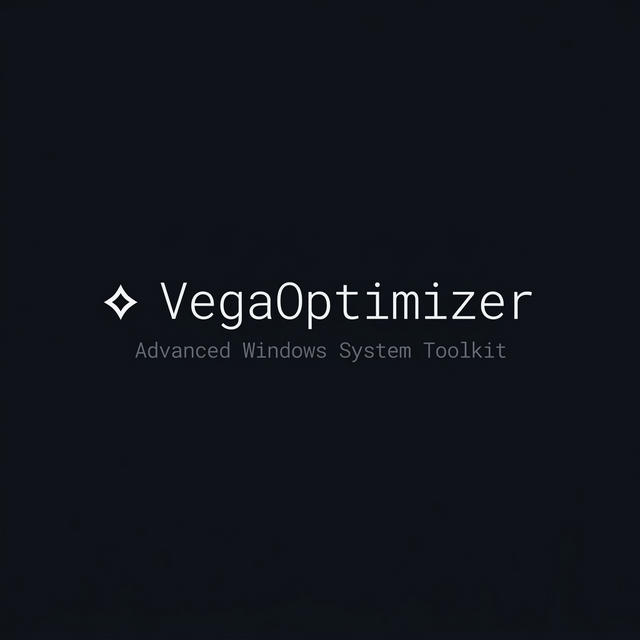

<p align="center">
  
</p>

<p align="center">
  <strong>Advanced Windows System Optimizer & Toolkit</strong><br>
  <sub>Built with Tauri v2 · React · Rust — Native performance, zero bloat</sub>
</p>

<p align="center">
  <a href="#features"></a>
  <a href="#tech-stack"></a>
  <a href="#tech-stack"></a>
  <a href="#tech-stack"></a>
  <a href="LICENSE"></a>
</p>

---

## Overview

VegaOptimizer is a **native Windows system toolkit** that provides real-time monitoring, deep optimization, and system maintenance — all in a single lightweight application. Built with a Rust backend for direct Win32 API access and a React frontend for a modern, responsive UI.

Unlike Electron-based alternatives, VegaOptimizer runs with **minimal memory footprint** (~15 MB) and has **direct kernel-level access** for memory management, process trimming, and service control.

---

## 🚀 What's New in v3.0

The massive v3.0 update brings robust system-level features and quality-of-life adjustments:

- **True Game Booster Mode**: Safely shifts your machine into High-Performance power plans while suspending heavy background services (SysMain, Spooler, etc.) via PowerShell wrappers.
- **Privacy & Telemetry Toggles**: One-click disables for Windows Cortana, Activity History, Advertising ID, and DiagTrack Telemetry.
- **Scheduled Tasks Manager**: Full visibility and toggling capabilities for background Windows scheduled tasks.
- **Improved Disk Analyzer**: Enhanced 8-depth iterative large file scanner with native File Explorer reveal integration.
- **Thorough Browser Cache Cleaner**: Fully recursive AppData cache sweeping for modern browsers like Chrome, Edge, and Brave.
- **Hardware Accuracy API**: Migrated GPU detecting and DDR4/DDR5 RAM type mapping away from deprecated WMI to direct `Get-CimInstance` PowerShell lookups.
- **Dashboard Drive Tracking**: Live monitoring of your OS drive's exact free space percentage directly from the main view.

---

## Features

### 📊 Monitor

| Module              | Description                                                                                                  |
| ------------------- | ------------------------------------------------------------------------------------------------------------ |
| **Dashboard**       | Real-time CPU, RAM, OS storage tracking, swap, per-core usage, temperatures, and system health score (0-100) |
| **Network Monitor** | Per-process connection tracking, TCP/UDP breakdown, top talkers, and ping testing                            |

### ⚡ Optimize

| Module               | Description                                                                                                                 |
| -------------------- | --------------------------------------------------------------------------------------------------------------------------- |
| **System Optimizer** | 30+ optimization items across memory, processes, services, disk, and network — with preset profiles & **Game Booster Mode** |
| **Process Manager**  | AI-powered suggestions for bloated/idle/duplicate processes, bulk trim with estimated savings, and per-process kill         |
| **Startup Manager**  | Enable/disable startup entries with impact ratings and registry-level toggling                                              |
| **Services & Tasks** | Full Windows service control, safety recommendations, and a dedicated **Scheduled Tasks Manager** tab                       |

### 🧹 Cleanup

| Module                | Description                                                                                                                 |
| --------------------- | --------------------------------------------------------------------------------------------------------------------------- |
| **Disk Analyzer**     | Deep recursive browser cache detection, iterative large file scanner (>100 MB), bulk delete, and "Open in Explorer" support |
| **Privacy Cleanup**   | Remove tracking data, browsing traces, recent file history, and **toggle Windows Telemetry settings** entirely              |
| **Windows Debloater** | Detect and remove preinstalled bloatware (AppX packages) with safe-to-remove classification                                 |
| **Registry Cleaner**  | Scan for orphaned keys, broken shortcuts, invalid paths, obsolete CLSIDs — with individual and bulk fix                     |
| **Duplicate Finder**  | Content-hash-based duplicate file detection with configurable minimum size and bulk delete                                  |

### 🔧 System

| Module               | Description                                                                                                |
| -------------------- | ---------------------------------------------------------------------------------------------------------- |
| **System Benchmark** | CPU single/multi-core scoring, RAM read/write/latency, disk sequential/random IOPS                         |
| **Disk Health**      | S.M.A.R.T. attribute monitoring, health percentage, temperature tracking per drive                         |
| **Driver Manager**   | List all installed drivers with signature verification status                                              |
| **Hardware Info**    | Full hardware inventory — CPU, true RAM typing (DDR4/5), accurate GPU detection, storage, network adapters |
| **Battery Health**   | Design vs. actual capacity, wear percentage, cycle count, charge rate, and estimated runtime               |

---

## Tech Stack

```
Frontend:   React 19 + TypeScript + Vite 7
Backend:    Rust + Tauri v2
Styling:    Vanilla CSS (dark theme, no framework)
Win32 API:  winapi (kernel-level memory/process/registry access)
System:     sysinfo, PowerShell (CIM Instances), tokio (async runtime)
```

---

## Prerequisites

- **Windows 10/11** (x64)
- [Node.js](https://nodejs.org/) v18+
- [Rust](https://rustup.rs/) (latest stable)
- [Tauri CLI](https://v2.tauri.app/start/prerequisites/) prerequisites

---

## Getting Started

### Clone & Install

```bash
git clone https://github.com/Pastarafian/VegaOptimizer.git
cd VegaOptimizer
npm install
```

### Development (with hot reload)

```bash
npx tauri dev
```

Or use the included launcher (requests admin for full functionality):

```bash
.\launch.bat
```

### Build for Production

```bash
npm run build
npx tauri build
```

This produces an `.msi` installer and portable `.exe` in `src-tauri/target/release/bundle/`.

---

## Admin Privileges

Many features require **Administrator privileges** for full functionality:

- Memory working set trimming (kernel-level)
- Game Booster power plan switching
- Standby list purging
- Service / Scheduled Task control
- Registry / Telemetry modifications
- Startup entry toggling
- System file deletion

The included `launch.bat` automatically requests elevation. Without admin rights, the app still works but some operations may fail silently or prompt.

---

## Screenshots

> _Run `npx tauri dev` and explore the 16-page toolkit yourself!_

---

## License

This project is licensed under the **GNU General Public License v3.0** — see the [LICENSE](LICENSE) file for details.

---

<p align="center">
  <sub>Built with ❤️ by <a href="https://github.com/Pastarafian">Pastarafian</a></sub>
</p>
